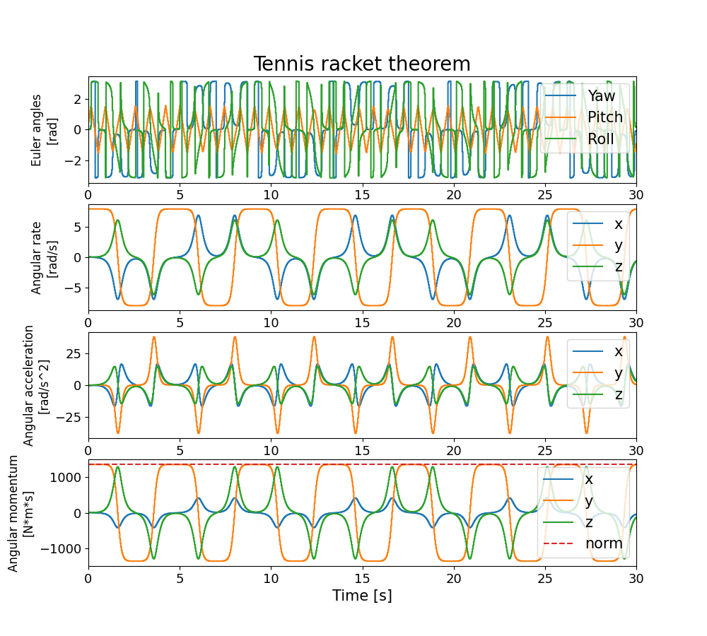
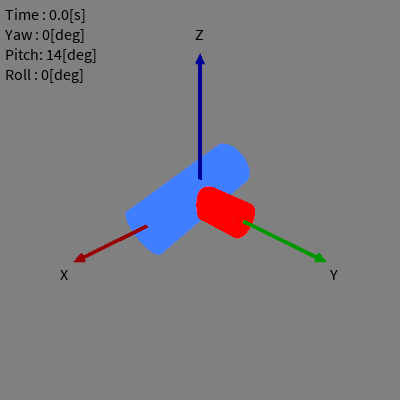

# テニスラケットの定理のシミュレーション

テニスラケットの定理（ジャニベコフ効果とも呼ばれます）をRustで実装したシミュレーションにより確認します。

## 実行方法

```
$ git clone https://github.com/HamaguRe/tennis_racket_theorem.git
$ cd tennis_racket_theorem
$ cargo run && python3 data_plot.py
```

## 実行結果



角速度・角加速度・角運動量は全て物体座標系上における値を表示しています。

## アニメーション



Processingコード（`./plot_animation/plot_animation.pde`）を実行することでアニメーション表示できます。

Processingコード内では、座標軸の表示に[1]のサイトに掲載されている関数を、円筒の表示に[2]のサイトで紹介されている関数を使用しています。

## 参考サイト
1. 理系大学院生の知識の森，『Processingで矢印を描く方法（３次元）』，[https://okasho-engineer.com/processing-3d-arrow/](https://okasho-engineer.com/processing-3d-arrow/)
2. peroon's diary，『processing proce55ing opengl 円柱』，[https://peroon.hatenablog.com/entry/20090428/1240929262](https://peroon.hatenablog.com/entry/20090428/1240929262)
